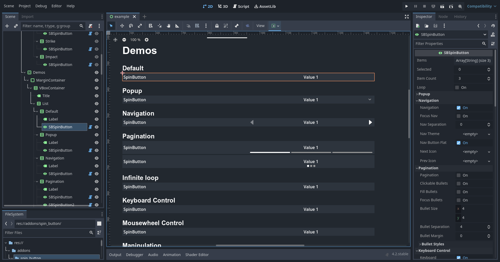
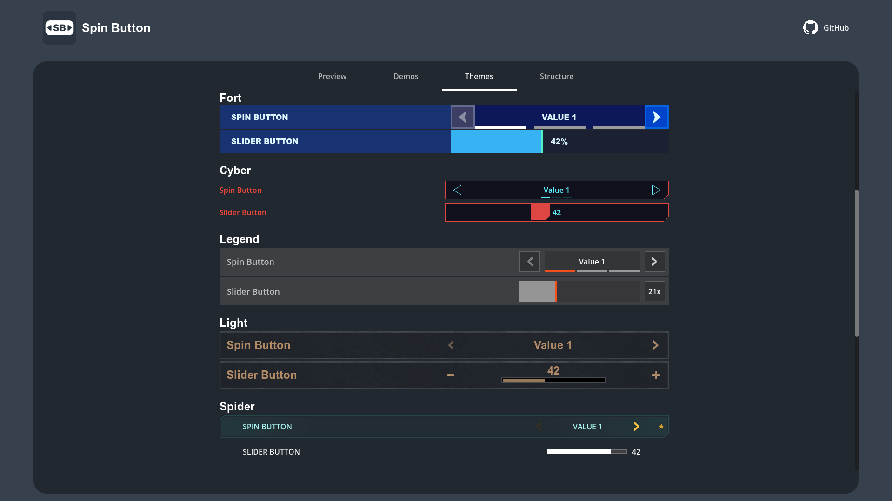
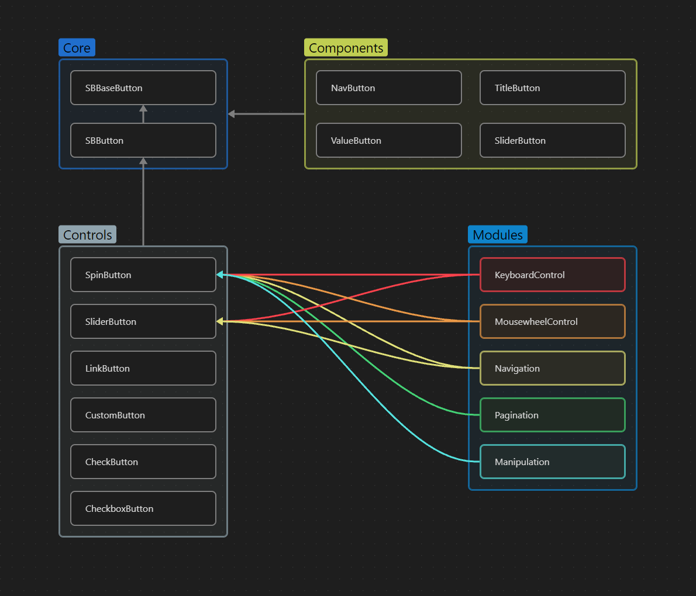

   

<h3 align="center">Spin Button</h3>

  Horizontal Selector with extended options for Godot Engine 4.x.

# Godot Spin Button

The addon adds a new "SpinButton" element that think of this thing as a dropdown but the navigation is managed by with next and previous controls. By incorporating this addon, users can conveniently choose options in a horizontal arrangement, thereby enhancing the overall user experience in Godot projects.

## ✨ Features

- **Modular Structure**

SpinButton has a modular structure and allows you to use only the necessary modules to make its size even smaller and the code clearer.

- **Rich API**

SpinButton comes with a very rich API. It allows creating your own pagination, navigation buttons, effects and many more.

- **Full Navigation Control**

SpinButton comes with all required built-in navigation elements, such as Pagination, Navigation arrows, Popup and Title with description.

- **Loop mode**

SpinButton has an option to loop through the options.

- **Popup**

SpinButton comes with a popup that opens when clicked, just like OptionButton.

- **Manipulation**

SpinButton has the ability to manipulate data using methods such as Append, Prepend, Add, Remove and Remove All.

- **Title & Description**

SpinButton comes with a title and description that can be displayed by events such as: hover, focus, always or never.

- **Keyboard control**

- **Mousewheel control**

- **Navigation**

- **Icons**

- **And many more...**

Slider, link, check, checkbox and custom button.

## 🎨 Theme

With SpinButton, you can replicate a theme from many major AAA games or you can create your own unique theme.

## 📚 Structure

The addon has a clear structure, which is demonstrated for each button in the corresponding tab of the example.

## 💬 Note

If you have any suggestions or encounter any problems when using the app, please feel free to contact us by email. I am ready to help you and solve any of your problems.

## 🔐 License

The source code of this project is licensed under the MIT license, which can be found [here](LICENSE).

---

> nikitayudin782@gmail.com &nbsp;&middot;&nbsp;
> GitHub [@nblackninja](https://github.com/с) &nbsp;&middot;&nbsp;
> Telegram [@yudinikita](https://t.me/yudinikita)
